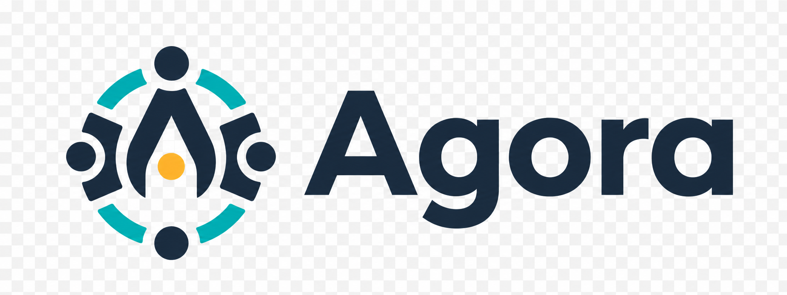

<p align="center">
  
</p>

# Agora Studio

Agora Studio is a local, read-only operations console for Agora projects. It binds only to
`127.0.0.1`, keeps the selected project in memory, and visualizes durable project state through an
explicit allowlist of structured Agora CLI reads.

Run it without installing dependencies:

```sh
python3 -m agora_studio --port 7357
```

Open the printed URL to select a local project and browse its overview, actors, swarms, work,
sessions, and chronological Activity Ledger. The server exposes:

- `GET /` for the visual console;
- `POST /api/projects/select` with `{"path":"/absolute/project/path"}`; and
- `GET /api/project` for the current selection;
- `GET /api/overview` for the selected project's allowlisted read-only snapshot; and
- `GET /api/activity` for a validated, bounded `activity list` read with optional `type`, `actor`,
  `swarm`, `work`, `session`, `tool_run`, and `limit` query fields; and
- `GET /api/lifecycle?swarm=<slug>&work=<slug>` for the selected work's normalized Method topology,
  durable transition path, traceability records, and registered specification revisions;
- `GET /api/lifecycle/revision?swarm=<slug>&work=<slug>&revision=<id>` for an allowlisted, bounded
  plain-text diff belonging to a revision returned by the lifecycle projection; and
- `GET /assets/<allowlisted-file>` for local interface assets.

Lifecycle reads accept one canonical selected project and safe Agora slugs only. Method records are
bounded to the selected pack's canonical Markdown files, and Git reads use fixed direct argument
vectors, short timeouts, output caps, and the one registered `repo://` specification path.

Run the offline test suite with:

```sh
python3 -m unittest discover -s tests -v
```
