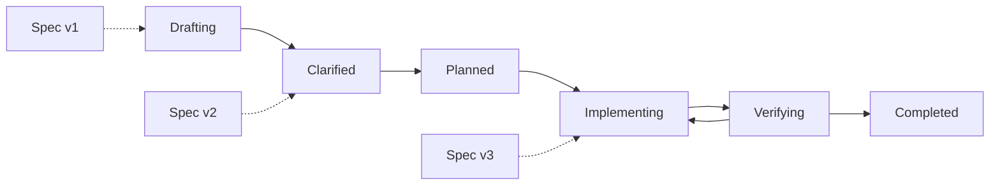

# Agora Studio Lifecycle and Specification Evolution Graph

## Status and ownership

- Active swarm: `studio-lifecycle-graph`
- Active work item: `lifecycle-spec-evolution-graph`
- Method: `spec-driven`
- Specification owner: `project:specification-agent`
- Developer: `project:agent`
- Status: drafting; registered as the work item's canonical `spec` artifact

## Clarification record

- The registered specification URI is `repo://docs/specs/lifecycle-spec-evolution-graph.md`.
- The feature is a read-only extension of the existing selected-project and selected-work experience.
- Method Pack declarations, durable Agora Activity, and bounded native Git reads are the respective
  authorities for allowed topology, actual work history, and specification revisions.
- Missing or ambiguous relationships remain explicitly unavailable; the implementation must not
  infer actors, sessions, commits, causality, or approval from temporal proximity.
- Delivery planning and verification evidence belong to later lifecycle phases and do not alter the
  clarified product, safety, accessibility, or verification requirements below.

## Objective

Add a read-only visual graph to Agora Studio that explains both the lifecycle state machine of the
active Method Pack and the actual evolution of a selected work specification. A developer must be
able to distinguish what transitions are allowed, what path the work actually followed, which spec
revision existed at each point, and which human or agent produced every durable change.

This is a follow-up to `activity-timeline-mvp`. It must reuse the existing project selection,
overview, Activity boundary, accessibility patterns, and read-only safety model without changing
the accepted scope of that earlier work.

## User outcome

A developer selects a project and work item, opens its lifecycle visualization, and can:

1. understand the complete state machine defined by the work's active Method Pack;
2. see the actual state path overlaid on the allowed transitions;
3. identify the current state, blocked gates, retries, and handoffs;
4. follow every durable version of the registered specification;
5. relate a spec revision to its actor, session, Activity events, work state, and Git commit; and
6. inspect bounded revision details without mutating the project or leaving the graph context.

## Visual model

The Mermaid diagram is explanatory only. The implementation must derive nodes and edges from the
selected project's installed Method Pack and must not hardcode Spec-Driven, Scrum, Kanban, or a
linear lifecycle.

## Method state machine

- Resolve the selected work, its swarm, and its Method Pack using reviewed Agora data.
- Read only the canonical `.agora/methods/<method-id>/METHOD.md` and its canonical
  `transitions/*.md` and `gates/*.md` children.
- Parse Markdown front matter using the existing structured parser or an equivalent reviewed parser;
  do not infer transitions from filenames or prose.
- Render every declared work state and transition, including cycles and branches.
- Distinguish the initial, current, terminal, traversed, available, and gate-blocked states using
  shape, icon, label, and line treatment in addition to color.
- A transition detail identifies its source, target, permitted roles, gate, and currently recorded
  blockers when those facts are available.
- Invalid or incomplete custom Method Packs produce a safe partial-data state rather than a guessed
  graph.

## Actual work path

- Derive the actual path only from durable `work.transitioned` Activity events for the selected
  swarm and work.
- Preserve event order and show timestamp, actor, role when known, session, and durable source.
- Overlay traversed edges on the full Method Pack graph without hiding allowed but unused paths.
- Show retries such as `verifying -> implementing` as repeated traversals rather than duplicate
  state definitions.
- Show handoffs and failed or retried sessions as annotations attached to the relevant path segment;
  they are not lifecycle states.
- The current state and the latest durable transition remain visually prominent.

## Specification evolution

### Registered specification

- Locate the active spec only through the selected work's registered `spec` artifact and its
  canonical `repo://` URI.
- Reject non-repository URIs, paths outside the selected repository, traversal components, symbolic
  link escapes, and artifacts that are not regular files.
- Do not scan arbitrary project files to guess which document is the specification.

### Git revisions

- Prefer the installed native Git CLI for history and diff operations.
- Execute direct argv commands with `shell=False`, a bounded timeout, a captured-output limit, and a
  canonical spec path after `--`.
- Build revision nodes from commits that changed the registered spec, following renames when Git can
  do so safely.
- Each revision shows abbreviated commit SHA, timestamp, author, subject, work state at that time,
  and the durable actor or session when Activity provides an exact relationship.
- Represent a modified but uncommitted spec as a clearly labeled working-tree revision. Never imply
  that it is durable or approved.
- A selected revision may show bounded line counts, changed section headings, and an escaped textual
  diff on demand. Do not render active HTML from spec or diff content.
- If Git is unavailable or the spec has no committed history, preserve the Method and Activity graph
  and explain that revision history is unavailable.

## Interaction and layout

- Add a `Lifecycle` view or an equally clear entry from a selected work; do not replace Activity.
- The primary graph is unframed, uses the available work surface, and supports branching layouts.
- Selecting a state, transition, annotation, or spec revision opens one consistent detail region.
- The detail region links exact identifiers to already loaded Activity, artifacts, evidence,
  sessions, handoffs, approvals, and source references when present.
- Provide controls to fit the graph, reset the view, and toggle Method topology, actual path, and spec
  revisions. Avoid decorative controls and unnecessary animation.
- Preserve selection while related data remains available; clear it explicitly when project or work
  changes.
- Long identifiers and summaries wrap without resizing graph controls or obscuring adjacent content.

## API and read-only boundaries

Extend the existing Python standard-library server and explicit boundary pattern.

- Add one bounded API projection for Method topology and one for registered spec history, or one
  combined work-lifecycle projection if that keeps validation clearer.
- Accept only a selected canonical project plus validated swarm and work slugs.
- Method reads are allowlisted to the active pack's `METHOD.md`, `transitions`, and `gates` Markdown.
- Git operations are restricted to reviewed read-only history, status, and diff subsets for the one
  registered spec path.
- Agora Activity queries remain the authority for work transitions, actors, sessions, handoffs,
  artifacts, evidence, and approvals.
- Every subprocess receives a direct argument vector, bounded timeout, bounded output, minimal
  inherited environment, and captured exit status.
- Return normalized JSON projections. Never return raw commands, unrestricted stderr, environment
  values, private keys, credentials, provider reasoning, complete session transcripts, or arbitrary
  filesystem content.
- Do not add mutation endpoints, background watchers, WebSockets, polling, deployment behavior,
  databases, remote assets, or network dependencies.

## States and resilience

- **Loading:** retain navigation and identify whether Method, Activity, or Git data is loading.
- **No work selected:** present a clear work-selection action.
- **No transitions:** render the known current state and explain the missing topology.
- **No registered spec:** keep the lifecycle graph and report that spec evolution is unavailable.
- **No Git history:** keep durable Agora data and explain that revisions cannot be reconstructed.
- **Partial data:** render verified subsets and label unavailable relationships without inference.
- **Query failure:** retain the last successful graph, show a safe reason, and offer retry.
- **Stale response:** ignore results belonging to a previous project or work selection.

## Accessibility and responsive behavior

- Make every graph node and edge reachable by keyboard in a predictable order.
- Provide visible focus, descriptive accessible names, and announcements for selection changes.
- Include a synchronized textual or tabular representation containing the same states, transitions,
  spec revisions, and relationships for screen readers and users who prefer lists.
- Never use color as the only indicator of state, traversal, blocking, failure, or revision status.
- Support 320px width, 200% zoom, 44px controls, long-value wrapping, and logical detail placement.
- Disable graph and panel motion under `prefers-reduced-motion: reduce`.

## Acceptance criteria and verification

| Criterion | Required verification |
| --- | --- |
| `method-graph` | Fixtures prove topology is derived from linear, cyclic, and branching Method Pack transition documents without hardcoded method ids. |
| `actual-path` | Tests prove durable transitions overlay correctly, repeat traversals remain visible, and current state is accurate. |
| `spec-versions` | Tests cover committed revisions, rename following, an uncommitted revision, no history, and unavailable Git. |
| `traceability` | Tests link exact actors, sessions, handoffs, artifacts, evidence, approvals, commits, and source references without temporal inference. |
| `interaction` | Tests cover selection, layer toggles, fit/reset controls, retained context, work changes, and bounded revision detail. |
| `safety` | Boundary tests assert canonical paths, exact argv, `shell=False`, timeout, output bounds, escaped content, and rejection of traversal and arbitrary files. |
| `states` | Tests cover loading, no selection, missing topology, missing spec, partial data, Git failure, stale responses, and retry. |
| `accessibility` | Tests cover keyboard navigation, equivalent tabular data, focus, accessible names, non-color indicators, reduced motion, zoom, and narrow layout. |
| `tests` | The full offline suite passes without network access and includes existing foundation, visual console, and Activity regression suites. |

## Required artifacts

- `spec`
- `implementation-plan`
- `verification-report`

## Human verification

1. Compare the rendered topology with the active Method Pack transition documents.
2. Compare the highlighted actual path with `agora activity list` for the selected work.
3. Compare spec revisions, commit metadata, and the working-tree indicator with native Git output.
4. Inspect branching, retry, missing-spec, no-Git, partial-data, and safe failure fixtures.
5. Navigate the complete experience by keyboard and through the equivalent textual representation.
6. Repeat at desktop, mobile width, 200% zoom, and reduced motion.
7. Confirm browsing leaves Git and every Agora durable record unchanged.

## Non-goals

- Editing, reverting, approving, or publishing a specification.
- Mutating work, actors, swarms, sessions, tools, Method Packs, Git history, commits, or branches.
- Inferring intent, causality, authorship, or reasoning when durable identifiers do not establish it.
- Rendering raw provider output, chain-of-thought, unrestricted diffs, arbitrary Markdown HTML,
  credentials, private keys, environment variables, or arbitrary local files.
- Cross-project aggregation, live collaboration, notifications, analytics, deployment, remote fonts,
  or new frontend package and network dependencies.
